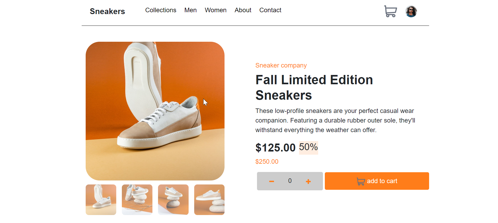

# Frontend Mentor - E-commerce product page solution

This is a solution to the [E-commerce product page challenge on Frontend Mentor](https://www.frontendmentor.io/challenges/ecommerce-product-page-UPsZ9MJp6). Frontend Mentor challenges help you improve your coding skills by building realistic projects.

## Table of contents

- [Overview](#overview)
  - [The challenge](#the-challenge)
  - [Screenshot](#screenshot)
  - [Links](#links)
- [My process](#my-process)
  - [Built with](#built-with)
  - [What I learned](#what-i-learned)
  - [Useful resources](#useful-resources)
- [Author](#author)

## Overview

### The challenge

Users should be able to:

- View the optimal layout for the site depending on their device's screen size
- See hover states for all interactive elements on the page
- Open a lightbox gallery by clicking on the large product image
- Switch the large product image by clicking on the small thumbnail images
- Add items to the cart
- View the cart and remove items from it

### Screenshot

### Links

- See Solution URL [here](https://github.com/abdishukri-105/e-commerce-product-page-)
- visit Live Site URL  [here](https://abdishukri-105.github.io/e-commerce-product-page-/)

## My process

### Built with

- Semantic HTML5 markup
- CSS custom properties
- Flexbox
- Desktop-first workflow
- Bootstrap 5

### What I learned
- how to create lightbox using html5 css and js
- how to create modal using html5 css and js
- how to show notification using js and css

### Useful resources

- [w3schools](https://www.w3schools.com/html/html_responsive.asp) - This helped me for learn more about responsive web design I really liked this pattern and will use it going forward.

## Author

- Frontend Mentor - [@abdishukri-105](https://www.frontendmentor.io/profile/abdishukri-105)
- Twitter - [@abdishukrimoh18](https://twitter.com/AbdishukriMoh18)

